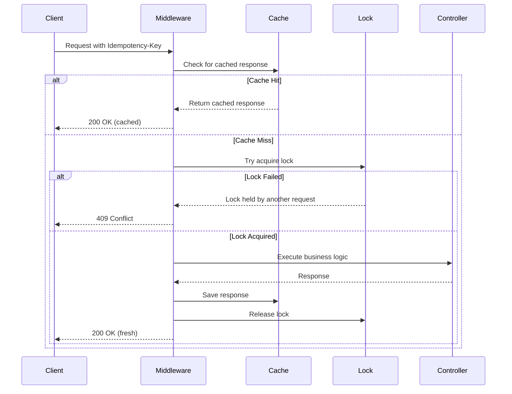

# IdempotencyShield

[](https://www.nuget.org/packages/IdempotencyShield)
[](https://opensource.org/licenses/MIT)

**IdempotencyShield** is a high-performance .NET middleware library that makes ASP.NET Core APIs resilient to duplicate requests and network issues (retry storms). It ensures idempotency through distributed locking, response caching, and payload validation.

## Features

✅ **Easy Integration** - Simple attribute-based decoration for controllers and actions  
✅ **Distributed Locking** - Prevents concurrent processing of duplicate requests  
✅ **Response Caching** - Instantly returns cached responses for duplicate requests  
✅ **Payload Validation** - SHA256 hashing ensures idempotency keys aren't reused with different payloads  
✅ **Thread-Safe** - Production-ready concurrent implementation  
✅ **Extensible** - Plugin your own storage backend (Redis, SQL, etc.)  
✅ **.NET 6+ Compatible** - Supports .NET 6, 8 and 10

## Installation

```bash
dotnet add package IdempotencyShield
```

> 📘 **New to Idempotency?**  
> Check out our **Step-by-Step Beginner's Guide**:
> [**Guide**](docs/GUIDE_EN.md)

## Quick Start

### 1. Register the Services

In your `Program.cs` or `Startup.cs`:

```csharp
using IdempotencyShield.Extensions;

var builder = WebApplication.CreateBuilder(args);

// Add IdempotencyShield with default configuration
builder.Services.AddIdempotencyShield();

// OR with custom configuration
builder.Services.AddIdempotencyShield(options =>
{
    options.HeaderName = "X-Idempotency-Key";
    options.DefaultExpiryMinutes = 120;
    options.LockTimeoutMilliseconds = 0;
});

var app = builder.Build();

app.UseRouting();

// Add the middleware AFTER UseRouting() so it can access endpoint metadata
app.UseIdempotencyShield();

app.MapControllers();

app.Run();
```

### 2. Decorate Your Controllers

```csharp
using IdempotencyShield.Attributes;
using Microsoft.AspNetCore.Mvc;

[ApiController]
[Route("api/[controller]")]
public class PaymentsController : ControllerBase
{
    [HttpPost]
    [Idempotent(ExpiryInMinutes = 60, ValidatePayload = true)]
    public async Task<IActionResult> ProcessPayment([FromBody] PaymentRequest request)
    {
        // Your business logic here
        // This will only execute once per unique Idempotency-Key
        
        var result = await _paymentService.ProcessAsync(request);
        return Ok(result);
    }
}
```

### 3. Send Requests with Idempotency Key

```bash
curl -X POST https://api.example.com/api/payments \
  -H "Content-Type: application/json" \
  -H "Idempotency-Key: 550e8400-e29b-41d4-a716-446655440000" \
  -d '{"amount": 100.00, "currency": "USD"}'
```

## How It Works



## Behavior & Status Codes

| Scenario | Status Code | Description |
|----------|-------------|-------------|
| First request | `2xx` | Executes controller, caches response |
| Duplicate request (same payload) | `200` | Returns cached response instantly |
| Duplicate request (different payload) | `422` | Unprocessable Entity - key reuse with different body |
| Concurrent requests (same key) | `409` | Conflict - another request is processing |
| No idempotency key provided | N/A | Proceeds normally without idempotency |

## Configuration Options

### IdempotencyOptions

```csharp
public class IdempotencyOptions
{
    // The HTTP header name for the idempotency key
    public string HeaderName { get; set; } = "Idempotency-Key";
    
    // Default expiry time in minutes for cached responses
    public int DefaultExpiryMinutes { get; set; } = 60;
    
    // Max time to wait for lock acquisition (0 = no wait)
    public int LockTimeoutMilliseconds { get; set; } = 0;
}
```

### IdempotentAttribute

```csharp
[Idempotent(
    ExpiryInMinutes = 60,      // How long to cache the response
    ValidatePayload = true      // Validate request body hash
)]
```

## Custom Storage Backend

The default `InMemoryIdempotencyStore` is suitable for single-instance development and testing. For production distributed systems, use the **Redis implementation**:

### Using Redis (Recommended for Production)

Install the Redis package:

```bash
dotnet add package IdempotencyShield.Redis
```

Configure in your application:

```csharp
using IdempotencyShield.Extensions;

// Simple setup
builder.Services.AddIdempotencyShieldWithRedis("localhost:6379");

// Production setup with SSL and resilience
builder.Services.AddIdempotencyShieldWithRedis(
    redisConfiguration: "your-redis-server:6379,password=secret,ssl=true",
    configureOptions: options =>
    {
        options.HeaderName = "Idempotency-Key";
        options.DefaultExpiryMinutes = 120;
    });
```

**Features**:
- ✅ Distributed locking with Redis SET NX
- ✅ Automatic expiration (TTL)
- ✅ Supports Redis Cluster and Sentinel
- ✅ JSON serialization
- ✅ Production-ready

📖 See the [Redis implementation documentation](src/IdempotencyShield.Redis/README.md) for complete details, examples, and best practices.

### Custom Implementation

You can also implement your own store:
```csharp
using IdempotencyShield.Storage;
using IdempotencyShield.Models;

public class RedisIdempotencyStore : IIdempotencyStore
{
    private readonly IConnectionMultiplexer _redis;
    
    public RedisIdempotencyStore(IConnectionMultiplexer redis)
    {
        _redis = redis;
    }
    
    public async Task<IdempotencyRecord?> GetAsync(string key, CancellationToken ct)
    {
        // Implement Redis GET logic
    }
    
    public async Task SaveAsync(string key, IdempotencyRecord record, int expiryMinutes, CancellationToken ct)
    {
        // Implement Redis SET with expiry
    }
    
    public async Task<bool> TryAcquireLockAsync(string key, CancellationToken ct)
    {
        // Implement Redis distributed lock (e.g., SET NX)
    }
    
    public async Task ReleaseLockAsync(string key, CancellationToken ct)
    {
        // Implement lock release (e.g., DEL)
    }
}

// Register your custom store
builder.Services.AddIdempotencyShield<RedisIdempotencyStore>();
```

## Best Practices

1. **Use UUIDs for Keys** - Generate unique idempotency keys on the client (e.g., UUID v4)
2. **Client Retries** - Configure exponential backoff for 409 Conflict responses
3. **Key Expiry** - Set appropriate expiry times based on your business requirements
4. **Payload Validation** - Keep `ValidatePayload = true` to prevent key reuse attacks
5. **Production Storage** - Use distributed stores (Redis, SQL) for multi-instance deployments
6. **Monitoring** - Log 409 and 422 responses to track retry storms and misuse

## Thread Safety

IdempotencyShield is fully thread-safe:
- `InMemoryIdempotencyStore` uses `ConcurrentDictionary` and `SemaphoreSlim`
- Automatic semaphore cleanup prevents memory leaks
- Proper lock release in `finally` blocks ensures no deadlocks

## Performance Considerations

- **Cache Hits**: Near-instant response (no controller execution)
- **Lock Contention**: 409 returned immediately (configurable timeout)
- **Memory**: In-memory store grows with unique keys (use expiry)
- **Overhead**: Minimal (~1-2ms) for hash computation and cache lookup

## License

This project is licensed under the MIT License.

## Contributing

Contributions are welcome! Please open an issue or submit a pull request.

## Support

For issues, questions, or feature requests, please open an issue on GitHub.
